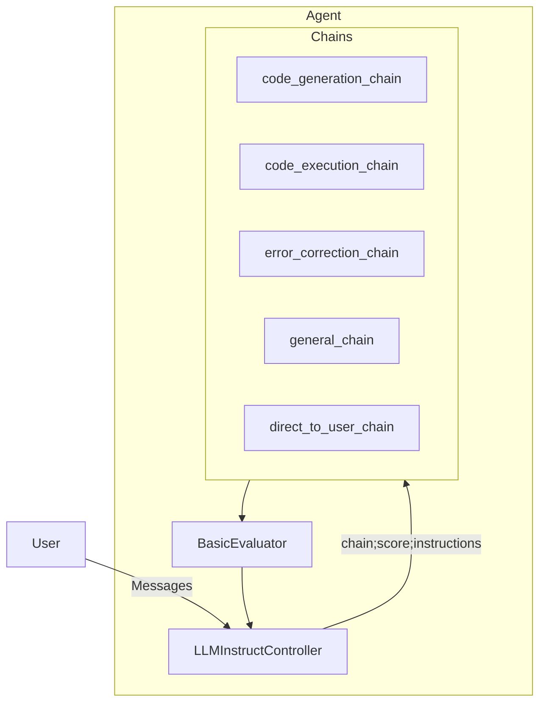

# council-python-agent

A general purpose interative Python coding assistant implemented with Council. Runnable as a standalone Python script or as a Flask/JavaScript app with a UI.

There is a custom controller, which is a development version of `LLMInstructController`
- `src/python_agent/controller.py`

## Demo Video and Files

If you just want to see how this Agent works, check out the following video where we use the Python Agent to help build a particle simulator!

- 📺 [Using the Python Agent to Create a Particle Simulator](https://drive.google.com/open?id=1kBgt-bM9tcOuVD59npUxgy8TdHyDO598&usp=drive_fs)
- 📄 [Demo Code and Transcripts](./demo_files/)

## Prerequisites

To run the demo as-is, you'll need an [OpenAI API Key](https://platform.openai.com/account/org-settings). Though it's possible to use GPT 3.5 Turbo, we highly recommend using GPT-4 for this demo. 

## Council Components

We define an **Agent** with the following structure:

## Demo setup

Before running the demo, you'll need to:
1. Install Council - `pip install council-ai==0.0.9`
2. Create a Python virtual environment for code execution (see below)
3. Populate your `.env` file with your virtual environment path and your OpenAI API key

### Virtual environment setup

You need to create a Python virtual environment.
1. In your Terminal, cd to `src/python_agent`
2. Run `python -m venv code_sandbox`
3. Run `source code_sandbox/bin/activate`
4. Install any packages you plan to use in your interactive coding, e.g. `pip install pygame`
5. Take note of the *full path* to your virtual environment's `bin` directory (e.g. `your-home-directory/council-python-agent/src/python_agent/code_sandbox/bin`)

## Running the demo

To run the demo, 
1. Navigate to the `src` directory in your Terminal
2. Run `python app.py`
3. Open the `src` directory in your file browser (e.g. Finder) then open `index.html` in your browser.
4. If you see `"No code to display."` in the code window and `"Ready."` in the log window below, your app is working and ready.

## Troubleshooting

- Keep the Terminal window running `app.py` open and visible. If there are unhandled errors, it will let you know. 
- If you get unhandled errors (e.g. `500` errors) you may need to restart both `app.py` **and your browser**. We're working on improving this in future revisions.